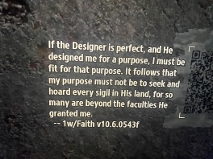
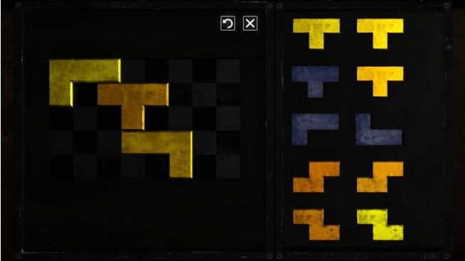

# CART 315 GAME PROTYPING: JOURNAL ENTRY 01,  TECHNICAL ANALYSIS OF TALOS PRINCIPLE I

## Author: Mollika Chakraborty 

### INTRODUCTION  

The first question the game makes you think as a player is; what makes humans a human? Is it just the consciousness that becomes the bridge between an AI and Human? One of the interesting things I have been observing within the game is that: there are several recordings as you proceed in the virtual world. Alexandra Drennan who used to be a human researcher working on the project Talos (as the narrative dictates) provides contexts of the player’s actions in the form of recordings. Through her voice the players understand the ethical and philosophical dilemmas the creators of the virtual world faced while looking for answers. One of her prompts defining the gap between Ai(s) and Humans felt very interesting to me it said “ Playing Games is a way of differentiating between humans and AI, because we don’t just play to learn something or to solve a problem, we play for fun, joy, sometimes anger and several other emotions which is not possible for an AI to comprehend the depth of it as it is possible for the humans”  
Throughout the game, players encounter various texts, audio recordings, and messages that further explore the implications of the Talos Principle. These philosophical musings and challenges contribute to the overall narrative and thematic depth of "The Talos Principle," creating an experience that goes beyond traditional puzzle-solving games.

These QR codes are assumed to be written by previous androids who tried to accomplish
Missions in the virtual world defying what God had planned for them. We see them quite often
In the game, sometimes as clues and sometimes as prompts supporting the narrative.

### THE CHARACTERS

"The Talos Principle" primarily features an unnamed protagonist, the player-controlled android, as the central character. The game is more focused on the philosophical narrative and puzzle-solving aspects than a cast of characters. However, there are other entities and voices that play a significant role in the game's world. Here are some notable elements:

• Elohim: Elohim is an unseen and powerful presence within the game, often referred to as the "God" of the virtual world. Elohim communicates with the player through terminals and guides them through the puzzles, urging them to seek knowledge and ascend to higher levels of understanding.

• Milton: Milton is an artificial intelligence entity that communicates with the player. Milton provides commentary on the nature of the world, the puzzles, and philosophical questions. The interactions with Milton contribute to the player's contemplation of their existence and purpose.

• Samsara Terminals: These are terminals found throughout the game that contain messages from previous iterations of the player's consciousness. These messages offer insights, guidance, and reflections on the nature of the world and the player's role within it.
While these entities contribute significantly to the narrative and philosophical themes, the game is intentionally sparse on traditional characters. The focus is more on the player's personal journey, reflections on existential questions, and the philosophical narrative woven into the puzzles and environment.

#### Merits and Demerits about limited characters

#### Merits 

• Limited characters help you focus more on the puzzle solving aspect of the game.

• Brings out the beautiful environment designing in a way that every player who has ever played Talos Principle would definitely talk about its surreal environment. 

• Players are encouraged to contemplate existential questions and the nature of consciousness without the distractions of extensive character interactions.

• Games with limited characters may have a broader appeal as players can project themselves onto the protagonist or AI entity more easily. This universality can make the game more accessible to a diverse audience.

#### Demerits 

• Limited characters may result in a lack of emotional engagement for some players. The absence of well-developed characters with whom players can form emotional connections might make the narrative feel distant or less impactful.

• Games with expansive character rosters can introduce diverse playstyles, abilities, and challenges, providing a more dynamic and varied gaming experience.

• The absence of dynamic character interactions may make the game's progression more predictable. Players might miss the unpredictability that emerges from characters with their own motivations, behaviors, and reactions to the game world.

• This can also lead to a distractive behavior during the game play as some players may not like to interact only with the voices, that happens in the game. Visual imagery is a lot more effective than voice overs in terms of generating a comprehensive gameplay experience. 

### TOOLS AND SIGILS 

• Connector: The Connector is a tool that allows players to redirect laser beams. It is essential for solving puzzles that involve activating switches, unlocking doors, or manipulating other elements in the environment.

• Jammer: The Jammer is a device that players can use to temporarily disable force fields, drones, and other obstacles. It plays a crucial role in overcoming challenges and accessing certain areas.

• Fan: The Fan is a tool that produces a powerful gust of wind. It can be used to propel objects, including players themselves, across gaps or into specific locations.

• Recorder: The Recorder allows players to record their actions and replay them, creating duplicates of themselves. This tool is used in puzzles that require teamwork or precise timing.

• Hexahedron: The Hexahedron is a cube that players can carry and use to hold down pressure plates or solve puzzles that involve manipulating physical objects.

• Red Sigils: Red Sigils are the primary collectibles in the game. They are often hidden or placed in challenging locations within puzzles. Collecting these sigils contributes to unlocking additional levels and areas.

• Yellow Sigils: Yellow Sigils are earned by completing more challenging versions of puzzles. These puzzles are often variations of existing ones but with added difficulty.

• Green Sigils: Green Sigils are awarded for completing the most challenging puzzles in the game. These puzzles are often located in special areas and require advanced problem-solving skills.

• Stars: Stars are special collectibles that players can acquire by solving particularly challenging or hidden puzzles. Collecting stars contributes to achieving certain endings and offers additional insights into the game's lore.

#### Merits 

• Multiple tools and sigils make the game interesting enough for the users to be stimulated enough and actually look for solutions within the game. 

• Different tools in the game have very different purposes that helps in the progression of the gameplay and makes you want to come back and play it again. 

#### Demerits 
• The tools are beautifully designed but there’s not enough clarification on how they work. Sometimes you need to troubleshoot or go to YouTube to find solutions. 

• Some of the tools like the “box” has too many constraints. As a player you can just jump on it and carry it which makes it difficult to surpass some levels within the game. 

• Another problematic tool is the connector, which again has the same problem as the box, it has limitations but those are not clear within the game. 

### THE TECHNIQUES AND MECHANICS I WOULD LIKE TO BORROW FOR MY FUTURE GAMES
• I would like to think of a complex narrative like the one as Talos Principle as I really enjoy mind twisting games.

• The beautifully crafted environment is also an inspiration for me that I would like to borrow for my name game. 

• Multiple tools with vibid purposes, although, unlike Talos Principle, I would like to provide proper description of them to avaoid confusion in the UI. 

• Talos Principle 1 is not a hard and fast game which is a trait I eally look for in games. Competitive games don't intrigue me as much, therefore, I would like to borrow that as well for my future projects. 

### WHY I LOVE THIS GAME? 

• Mind blowing fantastic OST 

• Philosophical Depth: The game delves into profound philosophical questions about consciousness, existence, free will, and the nature of reality. 

• Intellectual Challenge: "The Talos Principle" is a puzzle-solving game that offers a significant intellectual challenge. The puzzles become increasingly complex, requiring creativity, critical thinking, and problem-solving skills. 

• Rich Narrative: The game weaves a compelling narrative through environmental storytelling, audio logs, and philosophical texts. 

• Atmospheric World Design: The game features visually stunning environments that create an immersive atmosphere. The combination of ancient ruins, futuristic elements, and serene landscapes adds to the overall experience. 

• Freedom of Exploration: While primarily a puzzle game, "The Talos Principle" allows a degree of freedom in how players approach puzzles and explore the virtual world. This non-linear aspect can be appealing to those who enjoy open-ended gameplay and the freedom to explore at their own pace.

• Artificial Intelligence Themes: The exploration of artificial intelligence, consciousness, and the relationship between humans and machines adds a sci-fi element to the game. Those interested in themes related to AI ethics and the potential future of technology may find that intriguing.

