# CART 315 GAME PROTYPING: JOURNAL ENTRY 01,  TECHNICAL ANALYSIS OF TALOS PRINCIPLE I

## Author: Mollika Chakraborty 

### INTRODUCTION  

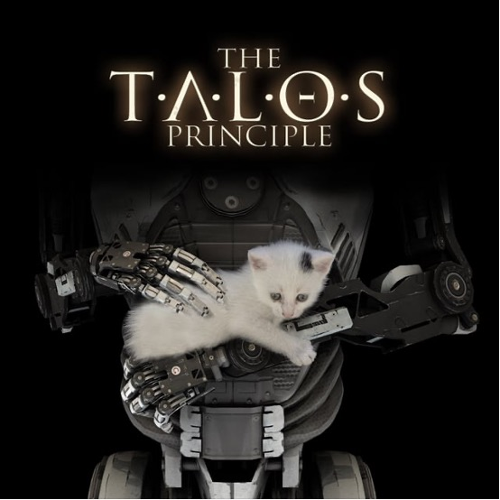

The first question the game makes you think as a player is; what makes humans a human? Is it just the consciousness that becomes the bridge between an AI and Human? One of the interesting things I have been observing within the game is that: there are several recordings as you proceed in the virtual world. Alexandra Drennan who used to be a human researcher working on the project Talos (as the narrative dictates) provides contexts of the player’s actions in the form of recordings. Through her voice the players understand the ethical and philosophical dilemmas the creators of the virtual world faced while looking for answers. One of her prompts defining the gap between Ai(s) and Humans felt very interesting to me it said “ Playing Games is a way of differentiating between humans and AI, because we don’t just play to learn something or to solve a problem, we play for fun, joy, sometimes anger and several other emotions which is not possible for an AI to comprehend the depth of it as it is possible for the humans”  
Throughout the game, players encounter various texts, audio recordings, and messages that further explore the implications of the Talos Principle. These philosophical musings and challenges contribute to the overall narrative and thematic depth of "The Talos Principle," creating an experience that goes beyond traditional puzzle-solving games.

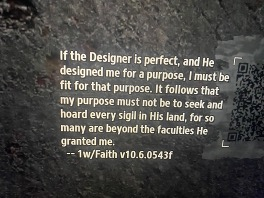

These QR codes are assumed to be written by previous androids who tried to accomplish
Missions in the virtual world defying what God had planned for them. We see them quite often
In the game, sometimes as clues and sometimes as prompts supporting the narrative.

### THE CHARACTERS

"The Talos Principle" primarily features an unnamed protagonist, the player-controlled android, as the central character. The game is more focused on the philosophical narrative and puzzle-solving aspects than a cast of characters. However, there are other entities and voices that play a significant role in the game's world. Here are some notable elements:

• Elohim: Elohim is an unseen and powerful presence within the game, often referred to as the "God" of the virtual world. Elohim communicates with the player through terminals and guides them through the puzzles, urging them to seek knowledge and ascend to higher levels of understanding.

• Milton: Milton is an artificial intelligence entity that communicates with the player. Milton provides commentary on the nature of the world, the puzzles, and philosophical questions. The interactions with Milton contribute to the player's contemplation of their existence and purpose.

• Samsara Terminals: These are terminals found throughout the game that contain messages from previous iterations of the player's consciousness. These messages offer insights, guidance, and reflections on the nature of the world and the player's role within it.
While these entities contribute significantly to the narrative and philosophical themes, the game is intentionally sparse on traditional characters. The focus is more on the player's personal journey, reflections on existential questions, and the philosophical narrative woven into the puzzles and environment.

#### Merits and Demerits about limited characters

#### Merits 

• Limited characters help you focus more on the puzzle solving aspect of the game.

• Brings out the beautiful environment designing in a way that every player who has ever played Talos Principle would definitely talk about its surreal environment. 

• Players are encouraged to contemplate existential questions and the nature of consciousness without the distractions of extensive character interactions.

• Games with limited characters may have a broader appeal as players can project themselves onto the protagonist or AI entity more easily. This universality can make the game more accessible to a diverse audience.

#### Demerits 

• Limited characters may result in a lack of emotional engagement for some players. The absence of well-developed characters with whom players can form emotional connections might make the narrative feel distant or less impactful.

• Games with expansive character rosters can introduce diverse playstyles, abilities, and challenges, providing a more dynamic and varied gaming experience.

• The absence of dynamic character interactions may make the game's progression more predictable. Players might miss the unpredictability that emerges from characters with their own motivations, behaviors, and reactions to the game world.

• This can also lead to a distractive behavior during the game play as some players may not like to interact only with the voices, that happens in the game. Visual imagery is a lot more effective than voice overs in terms of generating a comprehensive gameplay experience. 

### TOOLS AND SIGILS 

• Connector: The Connector is a tool that allows players to redirect laser beams. It is essential for solving puzzles that involve activating switches, unlocking doors, or manipulating other elements in the environment.

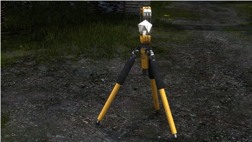

• Jammer: The Jammer is a device that players can use to temporarily disable force fields, drones, and other obstacles. It plays a crucial role in overcoming challenges and accessing certain areas.

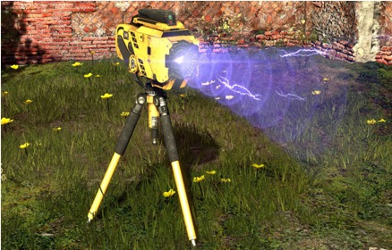

• Fan: The Fan is a tool that produces a powerful gust of wind. It can be used to propel objects, including players themselves, across gaps or into specific locations.

• Recorder: The Recorder allows players to record their actions and replay them, creating duplicates of themselves. This tool is used in puzzles that require teamwork or precise timing.

• Hexahedron: The Hexahedron is a cube that players can carry and use to hold down pressure plates or solve puzzles that involve manipulating physical objects.

• Red Sigils: Red Sigils are the primary collectibles in the game. They are often hidden or placed in challenging locations within puzzles. Collecting these sigils contributes to unlocking additional levels and areas.

• Yellow Sigils: Yellow Sigils are earned by completing more challenging versions of puzzles. These puzzles are often variations of existing ones but with added difficulty.

• Green Sigils: Green Sigils are awarded for completing the most challenging puzzles in the game. These puzzles are often located in special areas and require advanced problem-solving skills.

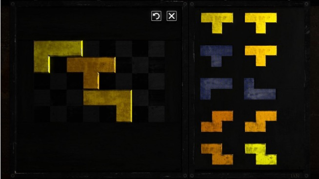

• Stars: Stars are special collectibles that players can acquire by solving particularly challenging or hidden puzzles. Collecting stars contributes to achieving certain endings and offers additional insights into the game's lore.

#### Merits 

• Multiple tools and sigils make the game interesting enough for the users to be stimulated enough and actually look for solutions within the game. 

• Different tools in the game have very different purposes that helps in the progression of the gameplay and makes you want to come back and play it again. 

#### Demerits 
• The tools are beautifully designed but there’s not enough clarification on how they work. Sometimes you need to troubleshoot or go to YouTube to find solutions. 

• Some of the tools like the “box” has too many constraints. As a player you can just jump on it and carry it which makes it difficult to surpass some levels within the game. 

• Another problematic tool is the connector, which again has the same problem as the box, it has limitations but those are not clear within the game. 

### THE TECHNIQUES AND MECHANICS I WOULD LIKE TO BORROW FOR MY FUTURE GAMES
• I would like to think of a complex narrative like the one as Talos Principle as I really enjoy mind twisting games.

• The beautifully crafted environment is also an inspiration for me that I would like to borrow for my name game. 

• Multiple tools with vibid purposes, although, unlike Talos Principle, I would like to provide proper description of them to avaoid confusion in the UI. 

• Talos Principle 1 is not a hard and fast game which is a trait I eally look for in games. Competitive games don't intrigue me as much, therefore, I would like to borrow that as well for my future projects. 

### WHY I LOVE THIS GAME? 

• Mind blowing fantastic OST 

• Philosophical Depth: The game delves into profound philosophical questions about consciousness, existence, free will, and the nature of reality. 

• Intellectual Challenge: "The Talos Principle" is a puzzle-solving game that offers a significant intellectual challenge. The puzzles become increasingly complex, requiring creativity, critical thinking, and problem-solving skills. 

• Rich Narrative: The game weaves a compelling narrative through environmental storytelling, audio logs, and philosophical texts. 

• Atmospheric World Design: The game features visually stunning environments that create an immersive atmosphere. The combination of ancient ruins, futuristic elements, and serene landscapes adds to the overall experience. 

• Freedom of Exploration: While primarily a puzzle game, "The Talos Principle" allows a degree of freedom in how players approach puzzles and explore the virtual world. This non-linear aspect can be appealing to those who enjoy open-ended gameplay and the freedom to explore at their own pace.

• Artificial Intelligence Themes: The exploration of artificial intelligence, consciousness, and the relationship between humans and machines adds a sci-fi element to the game. Those interested in themes related to AI ethics and the potential future of technology may find that intriguing.

# CART 315 GAME PROTYPING: JOURNAL ENTRY 02,  SHoot em up "SHMUP" Remix Project 

## Authors: Mollika Chakraborty & Maloney Khim 

## Game Title: Bug Bites 

### INTRODUCTION  

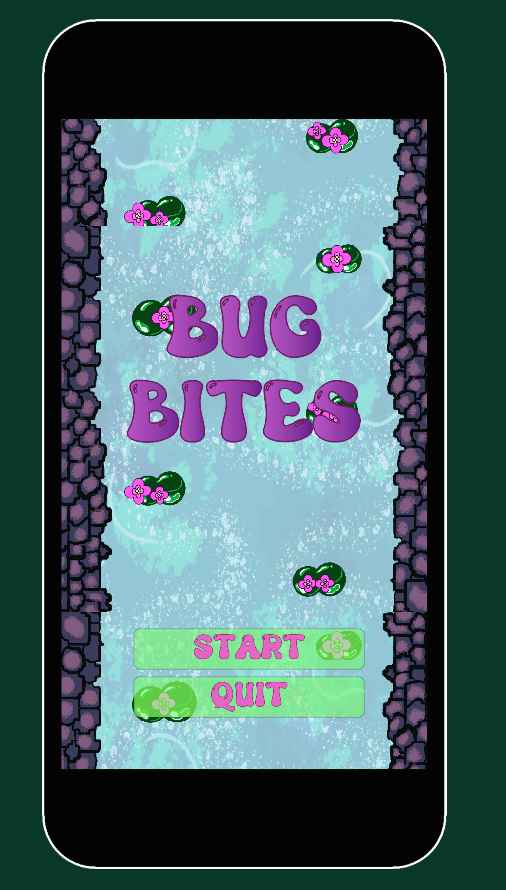

Bug Bites is a simplistic shooting game that we built as a mobile game. Originally we planned change the aspect ratio of the game to native 2k but as we started developing in 16:9 or 9:16 in portrait mode, it started to adapt more as a mobile game than a PC. The game is based on a Space Shooter Game, although we have added our personal touch to it and made it more nature centric.
The characters in the game include:
1) Frog (Player)

2) Beetles (Enemy 1)

3) Flies (Enemy 2)

4) Butterflies (Enemy 3)
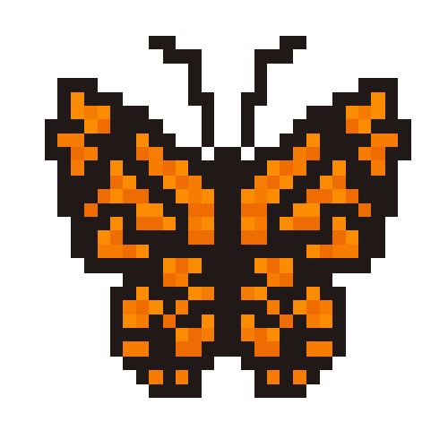

Every enemy has a different life size, depending on that are the number of bullets required to kill them.For example, beetles are killed with 1 bullet, 2 for the flies and 3 for the butterflies. 

### Inspiration and Aesthetics 

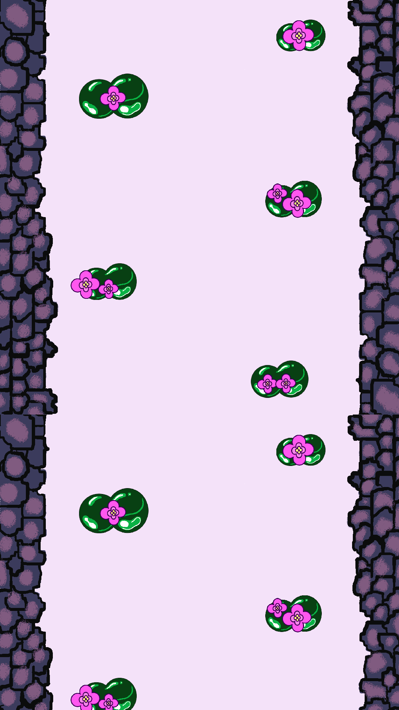 

Both Maloney and I are inclined towards the artistic side of game dev rather than technicalities. We adore fantasy worls and mystical creatures, which made us choose the popping colour scheme of the game (florocent green and blue). Although, we faced many challenges in Unity and C# therefore had to cut down on aesthetics and focus more on the game mechanics to understand the software better as we plan to build our career with it and to approximately reach the goals we had in mind during the initiation of the game. 

### Gameplay 

1) The player starts with the main menu.
2) Player is the frog, that's trying to kill all the bugs or (eat them).
3) Bugs are following a wave pattern and arrive randomly from random directions.
4) Player has 5 lives, bus are firing bullets as well constantly so the frog has to dodge them and score.
5) Scores can go up to 10 figures, although if the frog getts killed, it's game over. 
6) The final UI is the game over page where you can either restart or go back to main menu. 

### Problems encountered 
1) At first the players and the enemies were not in bounds of the canvas aspect ratio and were moving all
over the 2k native canvas.
2) While firing bullets the frog was getting killed very easily but the beetles were not getting killed at all.
3) Unity file got corrupted right before pushing it to a repository(this was dreadful, we thankfully had backup in a ssd).
4) UI was not adapatable to the zooming, this is kind of important as different users would play in different screens and settings.

### Benefits of working in a team

Working in a team is always preferable as it reduces stress and we learn from eath others' stregths and demerits. Both of us collaborated really well according to me. We did our fair share of artworks and coding for the game. The only issue was not being able to collaborate on a single file as we are not yet used to that feature of Github. Although we managed it really well. 

### Final Thoughts 

BUg Butes is not a perfect shooting game although it helped us understand some gameplay mechanics and how to make them using Unity and C#. We had many issues while coding and received great help from the Computation Lab and from in class notes. Overall it was a fun learning process. 

### Playtest Feedback 

1) The game lags a little during initiation.
2) The character design and backgrounds are beautifully done.
3) Variety in scores for the character and bugs and putting in more challenges inside the game. 
4) Could look even better if followed a narrative.
5) Adding Rewards 
6) Character levels uo after killing certain amount if bugs. 

###  References 
1) Thank you Udemy Concordia, We received great help from the tutorials 
2) https://www.kenney.nl/assets/impact-sounds (sound effects assets)
3) https://opengameart.org/content/forest (Theme music)
4) https://www.youtube.com/watch?v=XzgTl6MPz-E&t=19s (YouTube tutorials we followed)

# CART 315 GAME PROTYPING: JOURNAL ENTRY 02,  SHoot em up "SHMUP" Remix Project 

## Authors: Mollika Chakraborty & Maloney Khim 

## Game Title: Not Yet Decided 

### Introduction to 3 Main Game Ideas for the Final Project CART 315 

## Idea 1 

Concept:

The game centers around a human character navigating the complexities of life, striving for a balance between happiness and sadness. Players guide the character through a world filled with emotional landscapes. Happiness and sadness are not seen as opposing forces, but rather complementary aspects of a fulfilling life.

Gameplay:

The objective is to accumulate both happy and sad points while maintaining a state of equilibrium. Different obstacles represent challenges commonly encountered in real life, such as stress, anxiety, and depression. These obstacles manifest as dark, glowing blobs that the character must maneuver around or interact with to earn emotional points.

Future Development:

We plan to further refine the point system, assigning unique values and characteristics to each type of emotional obstacle. We also envision introducing levels with increasing difficulty and complexity.

## Idea 2 

Concept:

Title: Echoes of Empire (working title)

The game takes place within the vast halls of the British Museum. Players control a mysterious figure, an embodiment of historical restitution. They navigate the museum, seeking to return stolen artifacts to their rightful cultural homes.

Story and Gameplay:

The protagonist acts as both hero and hunted. They must locate and interact with hidden mechanisms or puzzles within the museum exhibits to trigger the repatriation of artifacts. This act could involve creating a symbolic connection or offering a heartfelt apology.

However, the protagonist is not alone.  Museum guards and security systems represent the resistance to returning stolen treasures. Players must utilize stealth, agility, and quick thinking to evade capture and complete their mission.

Themes and Historical Nuance:

The game explores the complex issue of historical artifacts and their cultural significance. It encourages players to consider the perspectives of both the colonizer and the colonized. While repatriation is a central theme, the narrative acknowledges the potential challenges faced by museums that house these collections.

Expansion Ideas:

Introduce playable characters who represent different stolen artifacts, each with unique abilities.
Include educational elements that provide historical context for the artifacts and the countries they originated from.
Offer different difficulty levels, with harder levels presenting more complex puzzles and stricter security measures.
Consider incorporating moral choices or consequences based on how the player interacts with museum objects.

## Idea 3

concept:
Your screen flickered, then blackness. You landed hard in a neon world of code and data rivers. A disembodied voice explained – you're digitized, trapped by a rogue program. Now, you're humanity's last hope in a digital war. You are now trapped in your device and have to fight viruses to get out. 

Your Mission:

Escape the System: Your primary goal is to find a way out of the digital world and return to your body. This exit point is heavily guarded, requiring you to navigate through the system's most critical components.
Collect Data Fragments: Scattered throughout the digital world are fragments of system data. These fragments hold vital information about the system's weaknesses and can be used by you to create powerful temporary upgrades for you.
Defeat the Master Virus: Master Virus resides deep within the Hard Drive, You must face the Master Virus in a final showdown to cleanse the system and ensure your escape.

Gameplay:

You are the digitized human, utilizing your agility and newfound digital abilities to navigate the landscape.
Basic attacks like punches and kicks can neutralize weaker viruses. As you collect data fragments, you can upgrade your abilities, allowing you to charge attacks, perform double jumps, or deflect projectiles. Jump across data streams, climb binary structures, and avoid environmental hazards.
Hidden warp zones within the Hard Drive can be accessed by solving logic puzzles, leading to bonus levels with more data fragments and powerful enemies.
Defeating viruses rewards you with experience points that unlock new skills and passive buffs.

The Master Virus:

This final boss is a corrupted code. It can manipulate the environment, creating electrical storms and summoning powerful virus minions. To defeat it, you'll need to exploit its vulnerabilities and utilize the full range of your upgraded abilities.

# CART 315 GAME PROTYPING: JOURNAL ENTRY 04,  Design Ideas Final Project, Prototyping Stage 1

## Authors: Mollika Chakraborty & Maloney Khim 

## Working Game Title: Give It Back!

### Design Progress and Game Mechanics 

### Game Map 
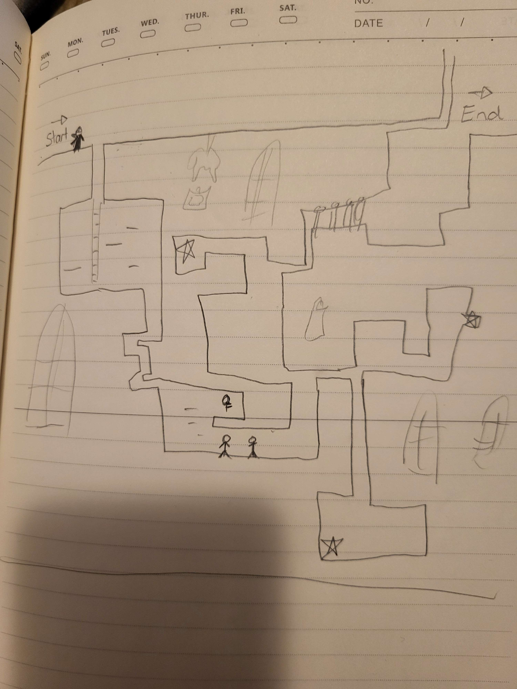

### Items to be found within the gameplay. 
1) The Portland Vase - Italy - key (to be defended to move on in the gameplay)
2) Lamassu - Iraq - guard 
3) Moai from Rapa Nui (Easter Island) in eastern Polynesia. - lasers 
4) Rosetta Stone - Egypt - guard 
5) Koh-i-Noor - India - key
6) Maqdala Manuscripts - Amba Marium/Maqdala - lasers 

### Types of enemies
1) Guards 
2) ecurity lasers
3) olonial ghosts

### Character 

The player embodies the persona of a stealthy ninja, adept at slipping through the shadows undetected, embodying a mysterious demeanor. As they navigate the museum's corridors in pursuit of the stolen treasures, their cunning and agility allow them to outmaneuver the guards. This ninja protagonist, with their enigmatic allure and formidable skills, serves as both the protagonist and the antagonist, conducting a daring heist to reclaim what rightfully belongs to the nations from which it was taken. This character design encapsulates the essence of a masterful detective, operating courageously to achieve their objectives without drawing unwanted attention.

### Gameplay
The player assumes the role of a daring thief on a mission to reclaim treasures plundered by the British from various countries throughout history. With a ticking clock adding urgency, the thief must navigate through a museum, aiming to locate and steal as many treasures as possible before making a clean getaway. To access certain prized artifacts, keys are essential, hidden within chests guarded by spectral entities. While contact with these ghosts doesn't end the game, it does incur time penalties. Additionally, the thief must evade detection by museum guards and sidestep security lasers, as any encounter with either will result in immediate failure.

### List of assets to be done
1) Player character sprites (normal, jump, run, climbing up/down, defeat)
2) Main background that is not interactable (museum background with windows, paintings, pillars etc.)
3) Interactable assets to move around (ladders, doors, platforms, floor grounds, etc.)
4) Key items (to unlock some rooms, a different one for each treasure)
5) Treasure items (each one gives the player some points)
6) Guards sprites (walking back and forth. The player needs to avoid touching them by jumping on platforms)
7) Laser sprites (in some sections of the museum, they go quickly across the room and the player needs to stay immobile to not be detected)
8) Colonial ghost sprites (optional, guarding the keys like the guards, but sometimes appear and disappear, makes the player lose time if they get in contact with them)
9) Opening & ending cutscene (optional, in a visual novel style or a comic style??)
10) UI and stuff
11) Title screen and Game over screen
12) Music & sound effects (we will get them from the internet)

### Additional Gameplay Mechanics (Optional) 
1) Puzzles and Riddles: To unlock a chest containing a key, the player must decipher Tetris patterns found on museum artifacts, piecing together clues scattered throughout the level. They might also need to rearrange paintings in a gallery to reveal hidden symbols that unlock secret passages.
2) Multiple Endings: At the end of the game, the player is presented with a choice: return the stolen artifacts to their rightful owners and gain redemption, or keep them and face the consequences of their actions. Each choice leads to a different ending, affecting the outcome of the story.
3) Dynamic AI: Guards have different patrol patterns and behaviors based on the difficulty level chosen by the player. Higher difficulty levels introduce smarter AI that can anticipate the player's movements and adapt to their strategies.

### Feedback from last class 
1) Make it Stealth-Platformer game 
2) incorporate various types of enemies 
3) Make it informative in a witty way, for example at the end of the game producing the list of items the ninja recovered and stating facts about the items, the country they belong to or how it was stolen. 
4) Adding ghosts like creatures inspired from Harry Potter movies and books. 
5) Make the character hide at the certain occasions within the game, this keeps the mystery alive. 

# CART 315 GAME PROTYPING: JOURNAL ENTRY 05,  Design Ideas Final Project, Prototyping Stage 2

## Authors: Mollika Chakraborty & Maloney Khim 

## Working Game Title: Give It Back!

### Design Progress and Game Mechanics 

### Game Map

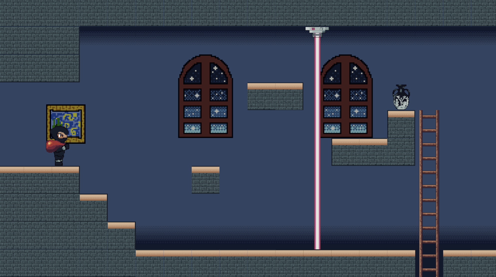

### Type of Game and Aesthetics
2D Platformer in a Museum Setting
Aesthetic: Pixel Art

### Target Audience

The target audience for this game would likely be Millenials and early Gen-Z who are interested in narrative-driven experiences with elements of stealth and puzzle-solving (optional). Additionally, individuals with an interest in history, cultural heritage, and social justice issues would be drawn to the game's themes and nuanced exploration of repatriation.

### Current Game Mechanics

We have been able to implement the basic goal of the game which is collecting the artifacts from a museum setting and earn points based on that. More time has been invested in designing than core technicalities uptil now, we are trying to achieve the basic interaction that can make this game "a game". The player is navigating the world, climbing ladders, avoiding enemies like the security guard, lasers, etc. and getting to the artifacts to be able to collect them and earn points. 

### Character Art 
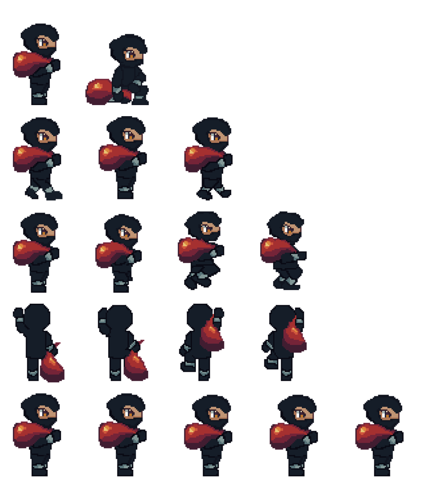
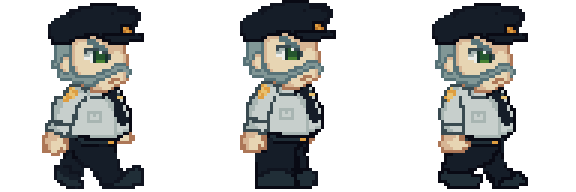

### Items to be collected 

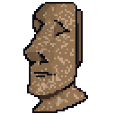
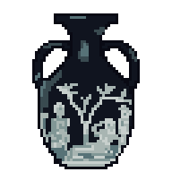
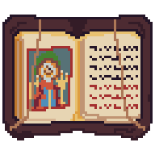
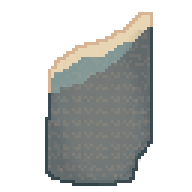

### Playtesting 

As this is a team project me and my teammate have been constantly trying to play while be run into issues, we have also asked our friends from the class to  try out the basic jump mechanics and moving of the character as that was the first thing we figured out. 
For some testers the jump was bit too high given that the tiles or the platform where you need to climb as a player are placed in lower levels. This makes the game too easy for them.

# CART 315 GAME PROTYPING: JOURNAL ENTRY 06,  Design Ideas Final Project, Prototyping Stage 3

## Authors: Mollika Chakraborty & Maloney Khim 

## Working Game Title: Give It Back!

### Major Issues 

We did run into major issues in terms of collision to work for our first enely called the guard. Everytime I made changes in the guard it somehow affected my player even though both the scripts are completely different. We did spend a lot of time trouble shooting which brought us back to an older version of the game we saved becuase we lost all the progress. 

### What we planned the game would do? 

Artifact Repatriation: The primary goal of the game is to collect stolen artifacts and return them to their rightful cultural homes (Although this would be something we will consider as the future expansion of this game as of yet we don’t have planned of how to narrate it via the game) Players must navigate through the museum's exhibits, and overcome obstacles to achieve this objective.

Educational Experience: The game aims to educate players about the complexities of cultural heritage and the impact of colonization on indigenous communities. The goal is to spark curiosity and foster a deeper appreciation for cultural diversity and historical restitution.

Moral Dilemmas and Choices: Throughout the game, players may encounter moral dilemmas and choices that impact the outcome of their journey. The goal is to encourage players to reflect on their actions and consider the ethical implications of returning stolen artifacts versus preserving them in museum collections.

Stealth and Strategy: Given the presence of museum guards and security systems, another goal of the game is to utilize stealth, agility, and quick thinking to evade capture and complete the mission. Players must carefully plan their actions and use the environment to their advantage to succeed.

# CART 315 GAME PROTYPING: JOURNAL ENTRY 07,  Design Ideas Final Project, Prototyping Stage 4

## Authors: Mollika Chakraborty & Maloney Khim 

## Working Game Title: Give It Back!

### Room for improvisations and fututre incorporations given the time crunch we faced

Narrative Exploration: As players progress through the game, they uncover little snippets of stories behind the artifacts and the historical context of their theft. The goal is to immerse players in a narrative experience that encourages empathy and understanding of different cultural perspectives.
Diverse enemy characters: We would like to incorporate more enemy character with different power levels, and more artifacts (of course they stole a lot) would be included with more levels. With every advancing level the gameplay would start getting difficult as we would include riddle solving, answer some questions and be able to collect artifacts. 
Every time you return these artifacts to their rightful countries you gain points and have access to different levels, although we plan to include negative marking as well which is yet to be decided. 

# CART 315 GAME PROTYPING: JOURNAL ENTRY 8, FINAL PROTOTYPING AND DESIGN JOURNAL 

## Authors: Mollika Chakraborty & Maloney Khim 

## Game Title: Give It Back! 

### Stages of Final Protytping, Solving Design Problems 

CART 315 Game Prototyping has been an amazing journey this semester, offering us the freedom to design a game at our own pace. It wasn't just about finishing a game for the sake of completion; rather, it was about comprehending the stages of prototyping and understanding how playtesting with classmates and their feedback can significantly enhance the game design in ways we, as the authors, might not have considered.

For our game, "Give It Back," both Maloney and I prioritize the visual design aspect over technical challenges. However, we acknowledge that tackling technical hurdles is an essential part of the learning process. We are satisfied with the visual aesthetics of our game, having learned a great deal about coding in C# and navigating the Unity UI. We experimented with various techniques, including Tilemaps, Lights, Postprocessing effects, VFX using Particle Systems, and implementing Cinemachine to enable a secondary camera to follow the player in the game.

From the class presentation we understood that it was not clear that this game is based on a night seting, the player eneters the museum at night under the watch of the security and lasers therefore incorporating feedback like adding whisper sounds from the audience would make less sense. This issue was solved when we delved deeper into the application of Bloom which is a post processing setup that gives additional glow to the assets that emit light. Other than that we have also included Vignette setting to give a darker volume to the overall setup making the scene quite dark where the lights get highlighted further enhancing the "Night look" we were hoping.  

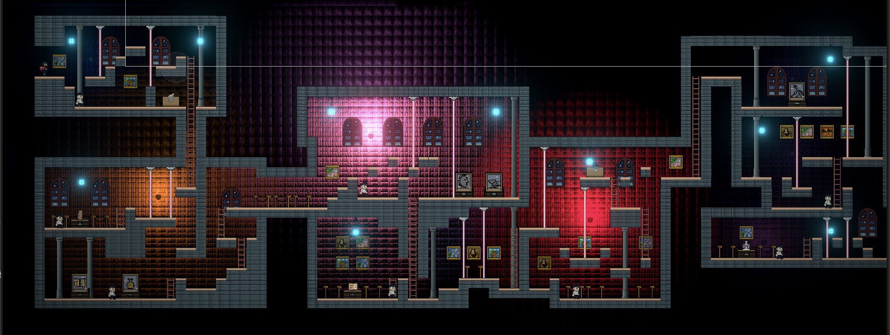

### Overview of the prototypes, what changed in a week? 

1) Aesthetically this prototype looks like a new game in comparison to the images or the protytpe we presented before. It has depth, the main camera is set to perspective which adds an additional volume to the game. Lights have been set up and animated. All the room s have different colours so that it does not get monotonous for the players. 

2) I on my part of the design process played with creating vfx, playing with the particle effect in unity. Now, when the player hits the lasers it proceeds with an electrocuting efffect quite similar to lightining and thunder. 

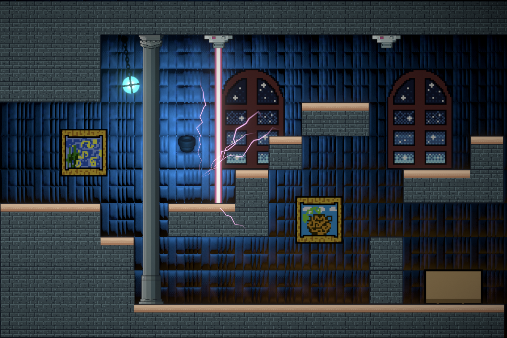

3) Lasers are attached to a script that regulates their switching on and off in a random speed. When it's on the collision is detected with the player and when it's off the collision switches off as well. It works well with the concept of laser security in places like museums. 

4) We have done basic scoring for now within the game therefore, everytime a precious item gets picked up by the player he scores 100 points. 

5) There is no game over for now, everytime the player encounters a security or if accidnetally gets hit by the lasers it automatically starts from the initial position. 

6) There are some minor issues in the ladder definitely with the collider, you need to jump twice to reach the tip of the collider in order to move forward on the ground. 

7) Maloney did the scoring for the game, and also the tile mapping to set up where the enemies would walk or the player would jump and walk. 

8) We decided to add music, dense in nature because we were going for the "heist" felling for the game without any reveal regarding the actual motive of it. 

### Feedback we received during the class 

1) To not lay it out there for the players that this is a British Museum based game rather it can benefit a lot if that concept is revealed as a climax. Our prof. gave us the example of board game called Train by Brenda Romero where players get to know at the end of the game play that the train they have been building with passengers is going to Auschwitz. 

2) Some of the classmates praised us for the visual design and the concept of the game mentioning that they would have quite a lot of fun playing this. 

3) Some suggestions were based on how we can add audience murmurs sound as the Museums have and some NPCs that can just be there and take selfies. ALthough this could have been done if the heist did not take place at night time. 

### What we could have done differently and our thoughts

1) We had a concept that as a team both of us agreed to and it had potemtial, it was something differemt and we are still very happy about our choices. 

2) We spent a lot of time designing of the game because as mentioned earlier both of us are more inclined towards the non-coding part of game like animation, visual design, assets designing, etc. Although with this class I would confidently  say I have learnt a lot in terms of game mechanincs and coding in C#. At the beginning of the class I mentioned that I wanted to become a gameplay animator and I am still sticking to that, but little coding doesn't hurt anyone. 

3) Collaboration is the biggest take away from me through this class, I did 2 team projects with Maloney and we were really compatible with each other, supported when required and learned together. 

4) Using GitHub for collaboration was not a beautiful experience. It crashed a lot, sometimes I pushed in one repository and maloney did not receive it, vice versa. At one point both our projects had merged issues and we had to go back to one of the older versions of the project to start working on it again. 

5) If I would have done this project alone it would have been quite stressful but because I had a great teammate we solved issues together. 

### Note for the professor 
Thank you for this amazing semester, learned a lot from you. Entered this class with a mindset that I would learn a lot of coding but I ended up learning many other things that makes a game and not just coding. 

### References 
1) https://www.youtube.com/watch?v=j29NgzV8Dw4&list=PLX2vGYjWbI0REfhDHPpdIBjjrzDHDP-xT I was extensive following this as it helped me solve coding issues, lighting issues and it also helped with some animated assets like the hanging lamp that added greatly to the aesthetics. 

2) https://www.youtube.com/watch?v=XPh0jiqf0iQ for the vfx. 

