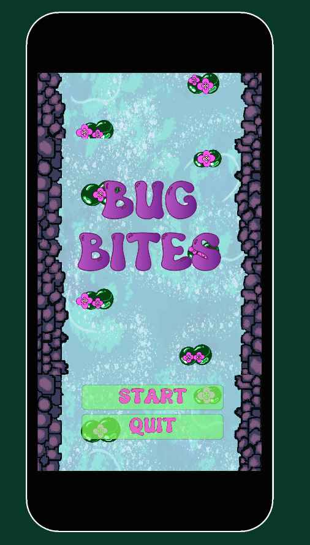
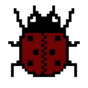
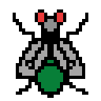
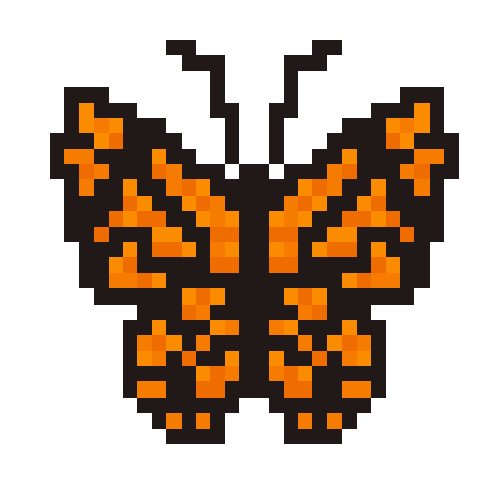
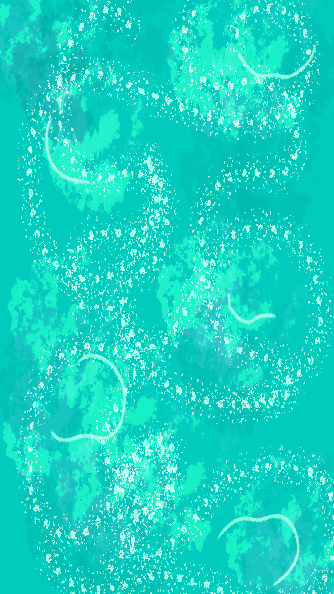

# CART 315 GAME PROTYPING: JOURNAL ENTRY 02,  SHoot em up "SHMUP" Remix Project 

## Authors: Mollika Chakraborty & Maloney Khim 

## Game Title: Bug Bites 

### INTRODUCTION  

Bug Bites is a simplistic shooting game that we built as a mobile game. Originally we planned change the aspect ratio of the game to native 2k but as we started developing in 16:9 or 9:16 in portrait mode, it started to adapt more as a mobile game than a PC. The game is based on a Space Shooter Game, although we have added our personal touch to it and made it more nature centric.
The characters in the game include:
1) Frog (Player)

2) Beetles (Enemy 1)

3) Flies (Enemy 2)

4) Butterflies (Enemy 3)

Every enemy has a different life size, depending on that are the number of bullets required to kill them.For example, beetles are killed with 1 bullet, 2 for the flies and 3 for the butterflies. 

### Inspiration and Aesthetics 

 

Both Maloney and I are inclined towards the artistic side of game dev rather than technicalities. We adore fantasy worls and mystical creatures, which made us choose the popping colour scheme of the game (florocent green and blue). Although, we faced many challenges in Unity and C# therefore had to cut down on aesthetics and focus more on the game mechanics to understand the software better as we plan to build our career with it and to approximately reach the goals we had in mind during the initiation of the game. 

### Gameplay 

1) The player starts with the main menu.
2) Player is the frog, that's trying to kill all the bugs or (eat them).
3) Bugs are following a wave pattern and arrive randomly from random directions.
4) Player has 5 lives, bus are firing bullets as well constantly so the frog has to dodge them and score.
5) Scores can go up to 10 figures, although if the frog getts killed, it's game over. 
6) The final UI is the game over page where you can either restart or go back to main menu. 

### Problems encountered 
1) At first the players and the enemies were not in bounds of the canvas aspect ratio and were moving all
over the 2k native canvas.
2) While firing bullets the frog was getting killed very easily but the beetles were not getting killed at all.
3) Unity file got corrupted right before pushing it to a repository(this was dreadful, we thankfully had backup in a ssd).
4) UI was not adapatable to the zooming, this is kind of important as different users would play in different screens and settings.

### Benefits of working in a team

Working in a team is always preferable as it reduces stress and we learn from eath others' stregths and demerits. Both of us collaborated really well according to me. We did our fair share of artworks and coding for the game. The only issue was not being able to collaborate on a single file as we are not yet used to that feature of Github. Although we managed it really well. 

### Final Thoughts 

BUg Butes is not a perfect shooting game although it helped us understand some gameplay mechanics and how to make them using Unity and C#. We had many issues while coding and received great help from the Computation Lab and from in class notes. Overall it was a fun learning process. 

### Playtest Feedback 

1) The game lags a little during initiation.
2) The character design and backgrounds are beautifully done.
3) Variety in scores for the character and bugs and putting in more challenges inside the game. 
4) Could look even better if followed a narrative.
5) Adding Rewards 
6) Character levels uo after killing certain amount if bugs. 

###  References 
1) Thank you Udemy Concordia, We received great help from the tutorials 
2) https://www.kenney.nl/assets/impact-sounds (sound effects assets)
3) https://opengameart.org/content/forest (Theme music)
4) https://www.youtube.com/watch?v=XzgTl6MPz-E&t=19s (YouTube tutorials we followed)

